# Power BI Roadmap - Session 1 Notes

**Date:** Monday, 28/07/2025
**Session:** Introduction to Power BI

---

## 1️⃣ Introduction to Power BI

Power BI is a **business intelligence and data visualization tool by Microsoft**.  
It helps convert raw data into **interactive dashboards and reports**, allowing businesses to make **data-driven decisions**.

Key highlights of Power BI:

- Can connect to multiple data sources (Excel, SQL, Web APIs, etc.).
- Provides **drag-and-drop visualization** features.
- Allows **data cleaning and transformation** without heavy coding.
- Enables **sharing dashboards and reports** on Power BI Service (cloud).

Use cases of Power BI:

- Analyzing sales and financial data.
- Creating company-wide performance dashboards.
- Reporting KPIs and operational metrics.

---

## 2️⃣ Installation of Power BI

To get started, we need **Power BI Desktop**:

1. **Download Power BI Desktop** from:
   - [Microsoft Store](https://apps.microsoft.com/store/detail/power-bi-desktop/9NTXR16HNW1T)
   - or [Official Power BI Website](https://powerbi.microsoft.com/)
2. **Install the application** like any Windows program.
3. **First look after installation:**
   - **Report View (Canvas):** Where you design dashboards.
   - **Data View:** Shows raw data tables after loading.
   - **Model View:** Displays relationships between tables.

---

## 3️⃣ Sections in Power BI

Power BI is broadly divided into **three main sections** for workflow:

### a) Power Query (ETL Layer)

- Purpose: **Extract, Transform, Load (ETL)** data before analysis.
- Common operations:
  - Removing duplicates
  - Splitting columns
  - Filtering rows
  - Changing data types
  - Merging and appending datasets
- **Interface:** Called _Power Query Editor_, opens in a separate window.

### b) Data Modeling

- Purpose: **Define relationships between tables** and build a logical model for reporting.
- Key points:
  - Create **one-to-many** and **many-to-many** relationships.
  - Set **primary and foreign keys** for relational modeling.
  - Hide unnecessary columns to simplify reporting.
  - Optimize model for **performance and simplicity**.

### c) DAX (Data Analysis Expressions)

- Purpose: Create **calculated columns, measures, and KPIs**.
- DAX is similar to Excel formulas but designed for **data aggregation and modeling**.
- Examples:
  - `SUM(Sales[Revenue])` → Sum of revenue column.
  - `CALCULATE(SUM(Sales[Revenue]), Region="West")` → Revenue for West region only.

---

## 4️⃣ Getting Data into Power BI

- Use the **Get Data** button on the Home ribbon.
- Popular data sources:
  - **Flat files:** Excel, CSV, JSON
  - **Databases:** SQL Server, MySQL, PostgreSQL
  - **Online services:** SharePoint, Google Analytics, Web APIs
- After selecting a source:
  1. Connect to the file or server.
  2. Preview data in **Navigator Window**.
  3. Load data directly or **Transform Data** in Power Query.

---

## 5️⃣ Power Query Data Cleaning Operations

During the session, we performed **basic data cleaning** using Power Query:

1. **Renaming Columns:**  
   Makes the dataset more readable for reporting.
2. **Changing Data Types:**  
   Example: Convert a column from _Text_ to _Date_ for time-based analysis.

3. **Removing Unnecessary Columns:**  
   Helps reduce clutter and memory usage.

4. **Filtering and Sorting:**  
   Only keep relevant rows and order data logically.

5. **Handling Missing Data:**  
   Replace nulls, remove blanks, or create default values.

6. **Removing Duplicates:**  
   Ensures accuracy in reporting, especially for sales or transactional data.

**Note:** All operations in Power Query are **recorded as steps** and can be modified or removed anytime.

---

## Dataset Tutorial and Steps

Make sure you have `AdventureWorks_Database.csv` and `Budget.csv` files present in your local system, you can download them from this repositary

### Step 1 : Importing Data Sets from the `Get Data` section of Ribbon

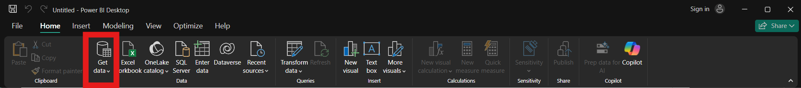

### Step 2 : Connect to `Excel Workbook` option and choose `AdventureWorks_Database.csv` from your local machine

### Step 3 : Select the Tables and Load the Dataset


### Step 4 : After loading, select the `Model View`

Review the relationships between tables and their connections to each other, PowerBI Auto Models the Dataset for you, but you can manually model your dataset through common `Primary Key` eg : Product Key and Dragging the relationships between them

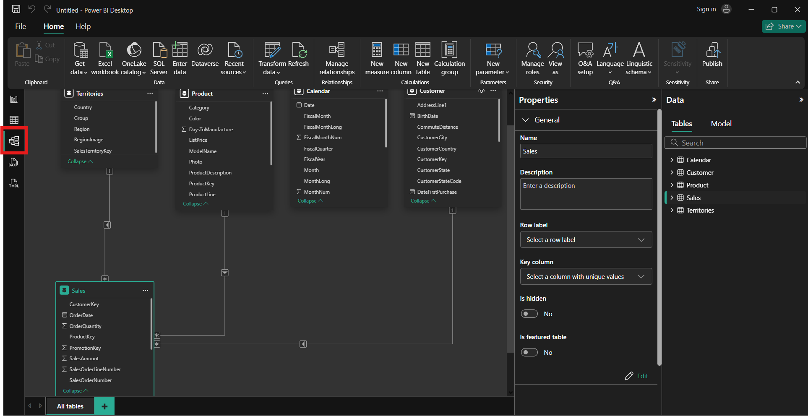

### Step 5 : Select `Get Data` Again and select `Budget.csv` and then select `Transform Data` option this time

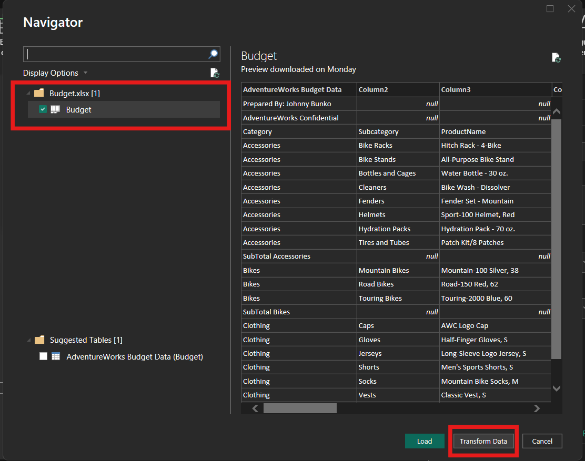

### Step 6 : Review the **Power Query Editor** and it's different section

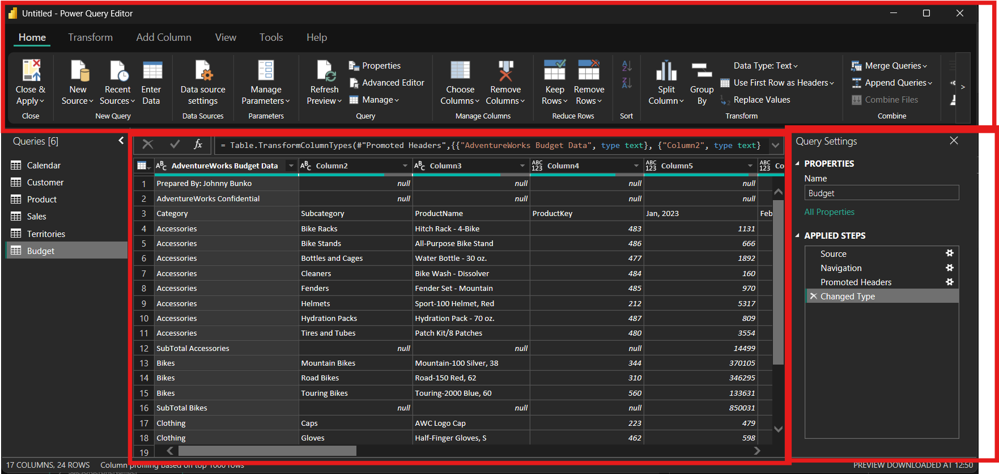

Applied Steps

Power Query Ribbon for operations

Table selection

## Data Cleaning Process

### Step 8 : Remove top redudant rows

We can see that first two rows are redudant and ought to be removed for clearning data purposes

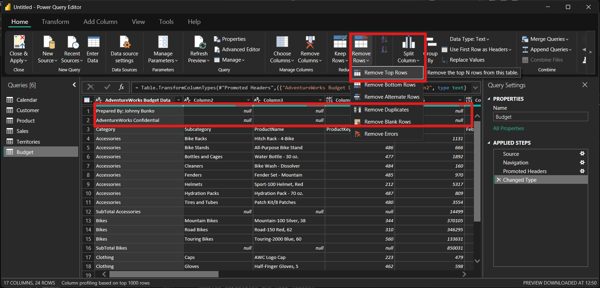

Write **2** in the input box to remove those rows

### Step 9 : Use Top Row as headers

For proper display purposes of the dataset, we can use Top Column Name as `Headers`, We can select

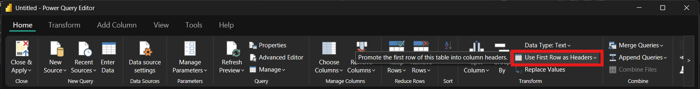

### Step 10 : Removing Redudant Columns

Scrolling to the Rightmost column `Grand Total` column is redudant for our purposes (it is derivable by summation of other columns)
Hence it can be removed by _Right clicking_ on the column and removing it

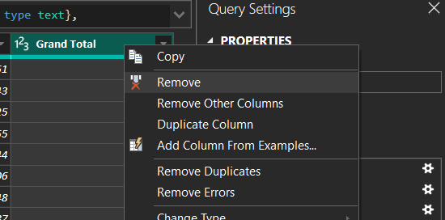

### Step 11 : Removing Redudant Rows

Looking at the dataset we can see that `subTotal` Rows have null values which ought to be removed, hence we have to filter them out

### Step 12 : Text filtering

in the `Category` Column we Select `Text Filters` Option -> `Does not Contain` to remove the redudant subTotal Rows
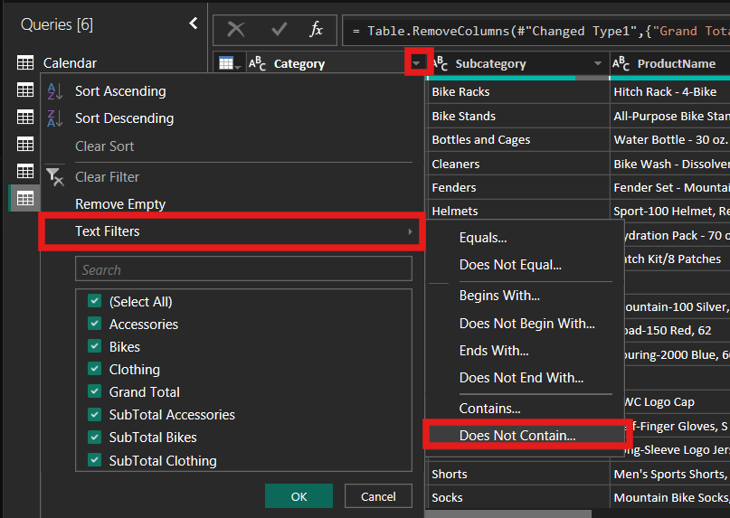

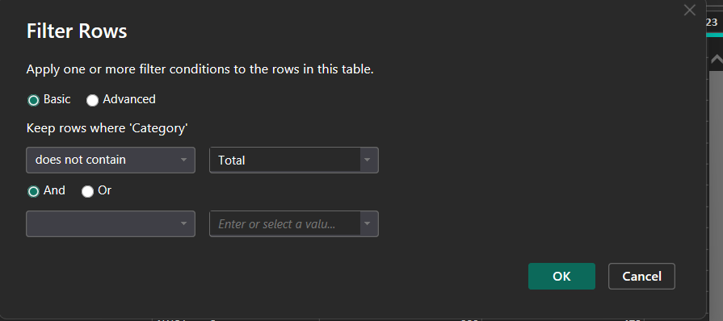

## Basic Data Transformation

### Step 13 : To Transform the Data to Convert from Column Years (`Jan`, `Feb`....) to Rows (Pivoting), Select The Year Columns and Press `Shift Key` to select all columns from `Jan` to `Dec`

### Step 14 : Go to `Transform` ribbon icon and select `Unpivot Columns` to pivot the columns to rows (while keeping the year columns selected)

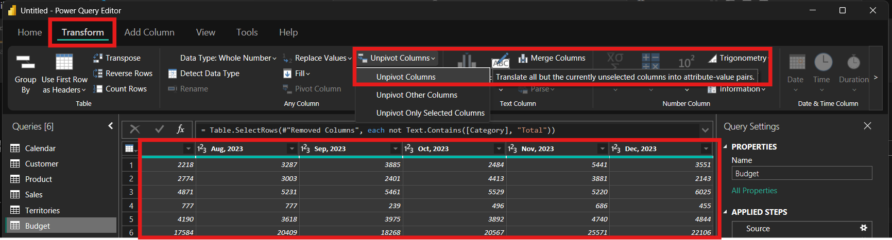

### Step 15 : Rename Column Name after Transformation -> Double Click on `Attribute` to change to `Date` and `Value` -> `BudgetAmount`

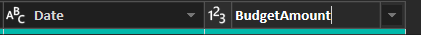

### Step 16 : Change Data Type of `Date` Column

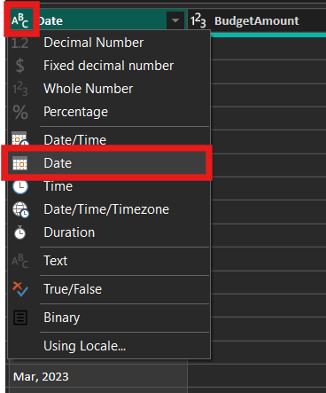

### Step 17 : Review the Steps in `Applied Steps` and `Close & Apply` the Changes

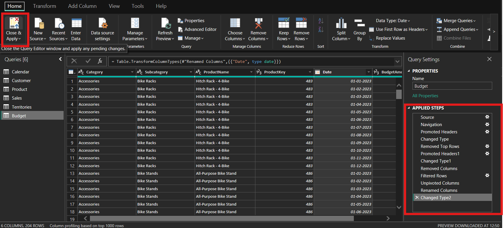

### Step 18 : Review the newly added `Budget Table` and Concept of **Data Tables** and ** Lookup Tables** in relation to these data sets

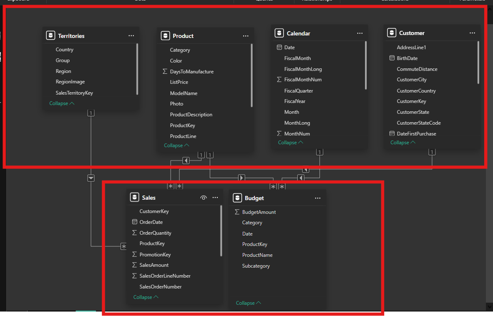

## 🛠️ Hands-On Summary

During the session, we:

- **Imported dataset** using _Get Data_.
- **Opened Power Query Editor** for cleaning.
- **Performed transformations:**
  - Removed duplicates and null values.
  - Renamed columns for clarity.
  - Changed column data types.
- **Closed and Applied** the cleaned dataset to Power BI.

---

## Next Steps (Session 2 Preview)

- Explore **Data Modeling** and create table relationships.
- Learn **basic DAX functions** for calculated columns and measures.
- Begin **creating visual dashboards** with charts and slicers.

---

# Power BI Roadmap - Session 2 Notes

PowerBI Session 2 will consist of **Advanced Data Visualisation** techquines, **Dax Measures** and **Forecasting**

## Pre-requiste step of Data Cleaning before Visualisation

### Step1 : Make sure to download `SuperStore.csv` from datasets

### Step 2 : `Get Data` -> `Text/csv` Data source and select `SuperStore.csv` from your local machine, make sure to click on `Transform Data` to open in Power Query Editor

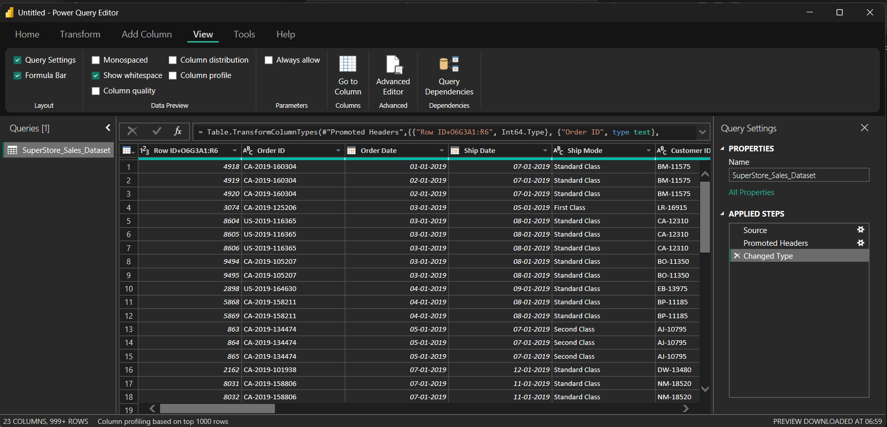

### Step 3 : Analyse the Data Types of each Column and the values present in each column

### Step 4 : Quick check the columns by doing `Ctrl + A` to select all columns then doing to `View` and selecting `Column Quality`

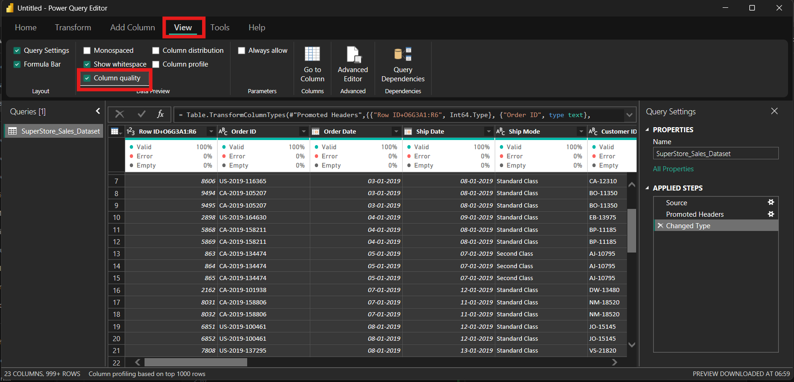

### Step 5 : Change Value of `Return` Column

Select the `Returns` Column and Right-Click to select the `Replace Values` Option

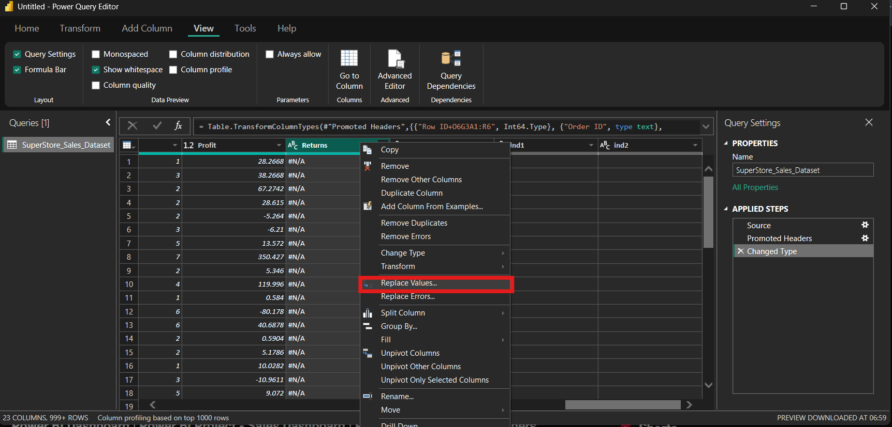

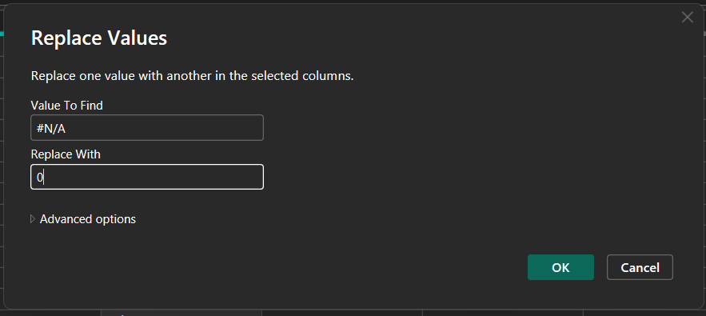

### Step 6 : Remove the last 2 empy columns

Slect the last 2 columns and Right Click to `Remove Columns`
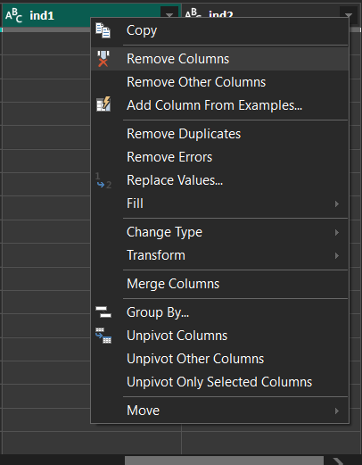

### Step 7 : Review the Steps in `Applied Steps` and then `Close & Apply` to Save and Load the changes

## Data Visualisation using Dashboard in PowerBI

### Step 8 : in the `Report View`, You can see all the columns in the `Data` Section as well as the Superstore Table and all its corrosponding Columns

### Step 9 : Select `Clustered Bar Chart`,

**X-Axis -> Category**

**Y-Axis -> Sales**  
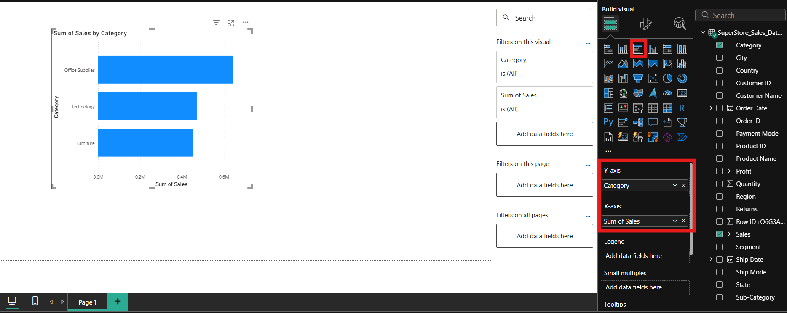

### Step 10 : Change background by selecting `Format your report Page` [Click anywhere on the canvas] and `Canvas Background` to select background gradient

### Step 11 : Select on the Clustered Bar Chart, then `Format Your Visual` to change the visualisation formatting

`General` -> `Effects` -> `Change Background Transperancy` [85%]

`General` -> `Effects` -> `Visual Border` ->
Change Border Color, Rounded Borders

`General` -> `Title` -> `Text` :
**Sales By Category**

`Horizontal Alignment` -> `Center`

`Visual` -> `Y- axis` -> `Values` : Color change, Maximum Width

`Visual` -> `X-axis` -> Values : off

`Visual` -> **Data Label** : ON

`Visual` -> **Bars** to change color

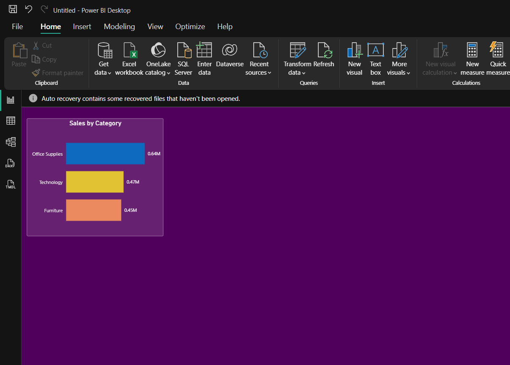

### Step 12 : Filtering and Sales by Top Sub Categories

Copy Paste the **Sales By Category** Bar chart

Edit the _Y-axis_ in the `Visualisation` Tab to add `Sub-Category` in Y-axis and remove `Category`

Filtering : Select `Filter Type` -> `Top N` -> 3

`By Value` -> Drag and Drop Sales from Data and apply filters

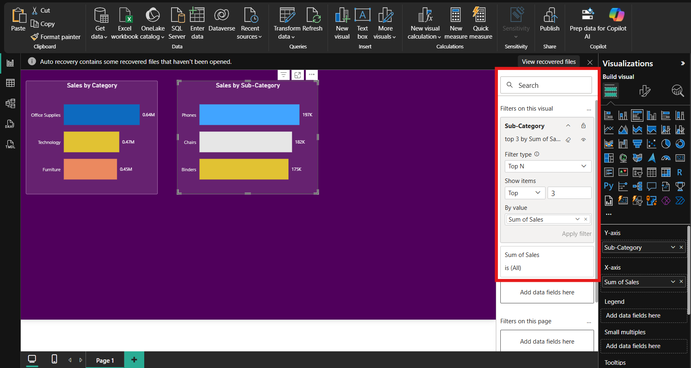

### Step 13 : Create similar Chart for **Sales by Ship Mode**

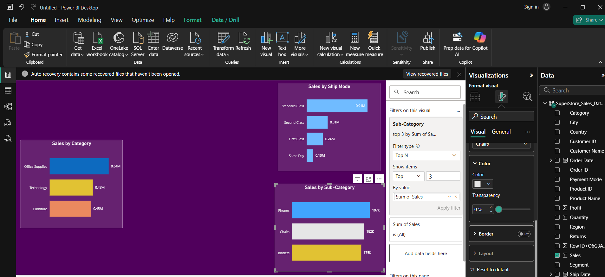

### Step 14 : Add `Stacked Area Chart` to show 2-Year monthly comparision

**X-axis** -> `Order Date`

**Y-axis** -> `Sales`

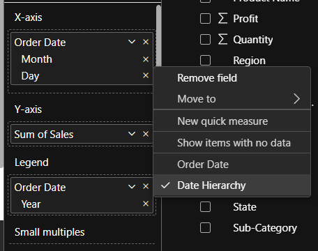

Make sure to add `Order Date` in `Legend` and Right-Click to select `Date Hierarchy`

Remove **Year**, **Quator** from X-axis

### Step 15 : Make Similar Chart for YoY Profits

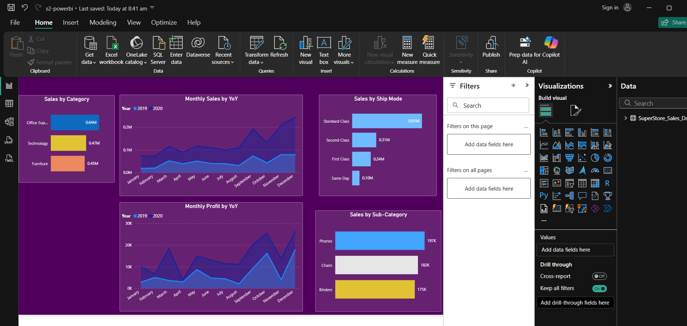

### Step 16 : Enabling Map

`File` -> `Options and Settings` -> `Options` -> `Security`

Select OK and Restart PowerBI
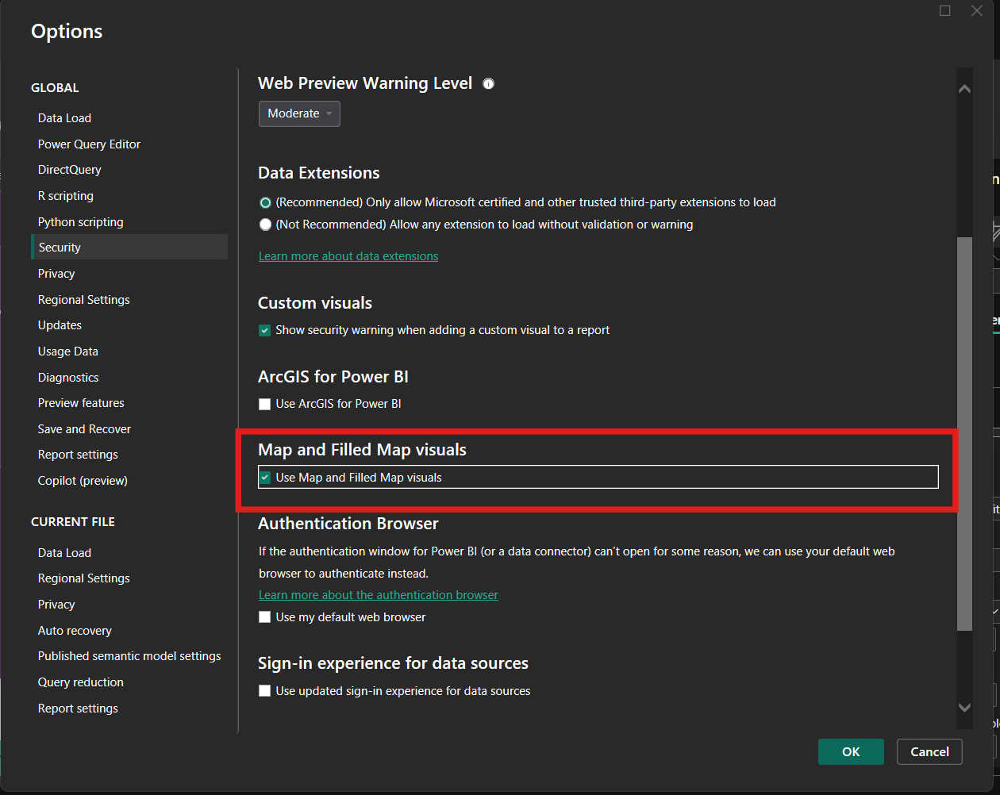

### Step 17 : Add Map on the dashboard and drag and drop `State` onto the Map (Y-axis)

Add `Sales` to the `Bubblesize`

Add `Profits` to the `ToolTips`

You can copy the format using Format Painter and change the Style of Map in `Map Settings` in Visualisation

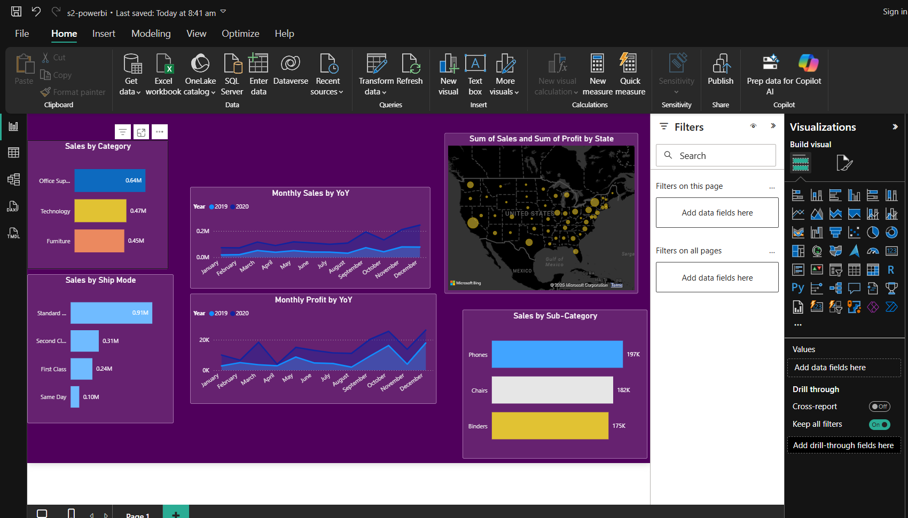

### Step 18 : Add `Donut Chart`

**Legend** -> **Segment**

**Values** -> **Sales**

### Step 19 : Create Similar Donout Chart for Modes of Payment

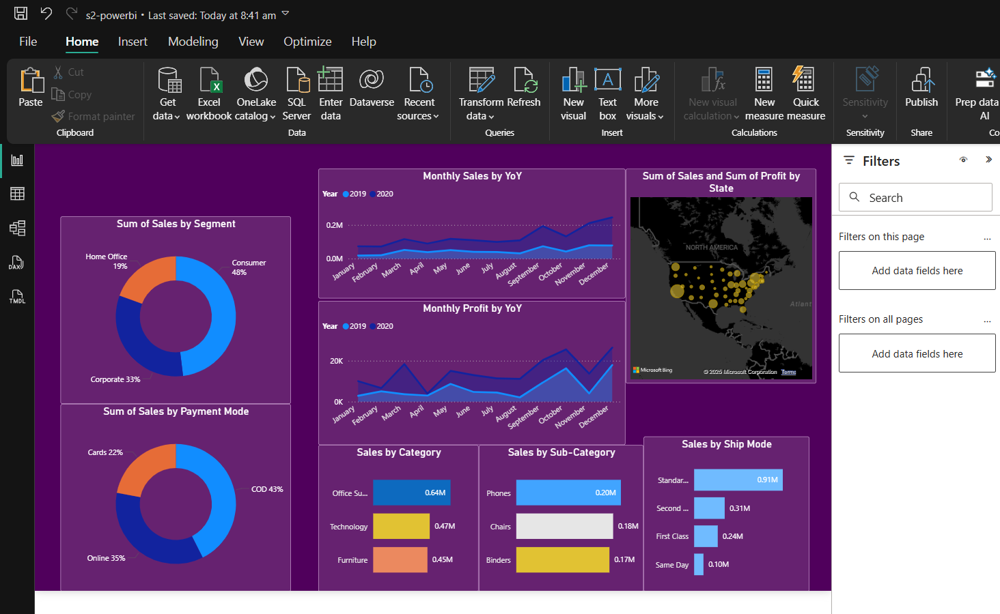

### Step 20 : Add Slicer By Region

Add `Slicer` From Visualization Tab, Then aadd `Region` to the fields, change the Format to **Tiles**

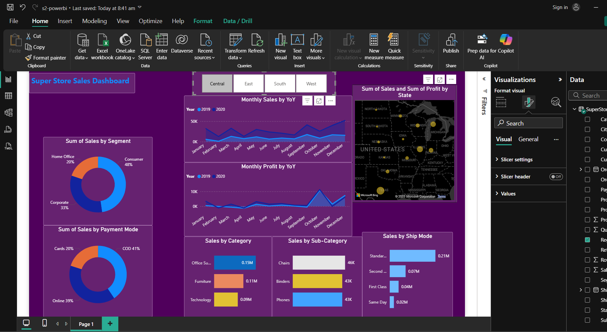

### Step 21 : Add textbox and other prettification of your choice

### Step 22 : KPI Display

Add **Card**

Then Add Fields, `Sales`, `Quantity`, `Profit`
for each card

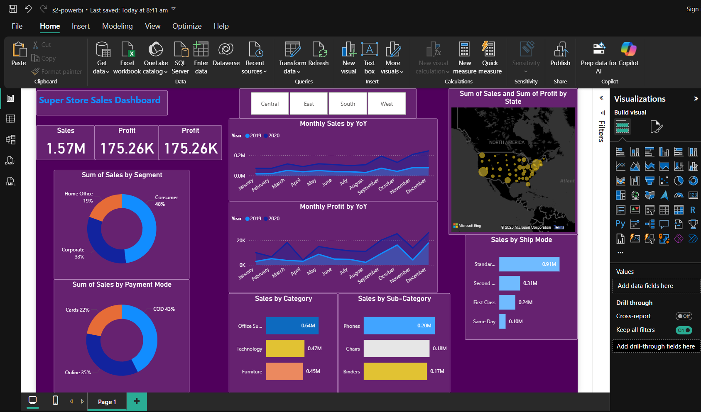

## DAX Queries and Analysis, Column Measure

### Step 23 : Select `Table View` and then Sleect **New Column**

### Step 24 : Specify the `DAX Query`

**AvgDelivery = DATEDIFF('SuperStore_Sales_Dataset'[Order Date], 'SuperStore_Sales_Dataset'[Ship Date], DAY)**

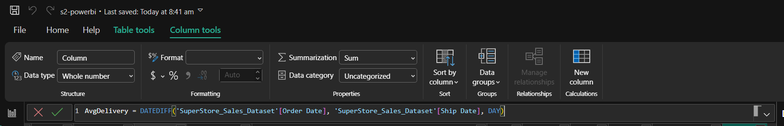

Click Enter to populate the New Column

Add Card in the `Report View` to add the Average Delivery Time

### Step 25 Queries

#### Total Number of Deliveries

Measure : **TotalDelivery = COUNTROWS('SuperStore_Sales_Dataset')**

#### No of Late Delivers

Measure : **LateDelivers = CALCULATE(COUNTROWS('SuperStore_Sales_Dataset'), DATEDIFF('SuperStore_Sales_Dataset'[Order Date], 'SuperStore_Sales_Dataset'[Ship Date], DAY) > 5)**

### Return Rate BY Product Name

Measure :
ReturnRate =
DIVIDE(
CALCULATE(COUNTROWS('SuperStore_Sales_Dataset'), 'SuperStore_Sales_Dataset'[Returns] = "1"),
CALCULATE(COUNTROWS('SuperStore_Sales_Dataset'))
)

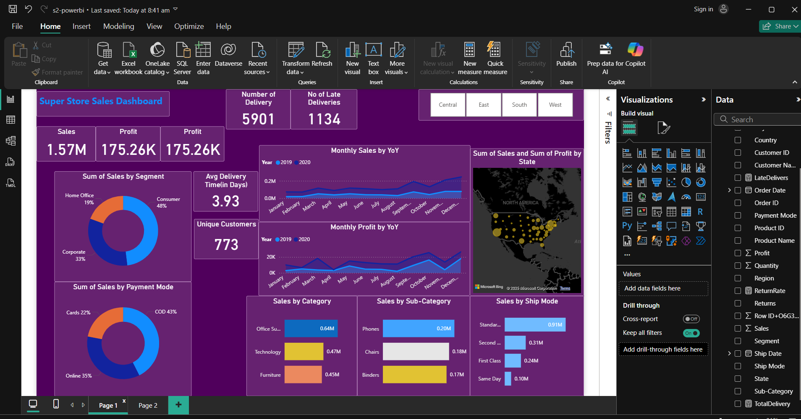

## Sales Forecasting

### Step 26 : Create New Sheet and Add `Line Chart`

Forecasting can be done only on **Line Chart**

X-Axis -> Order Date
Y-Axis -> Sales

### Step 27 : Remove `Year`, `Month`, `Quater` from X axis and Select by **Order Date**

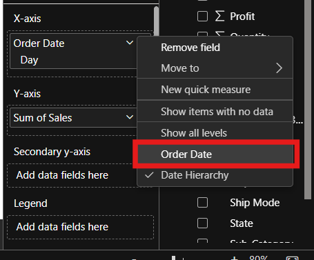

### Step 28 : Select `Add Futhur Analyses to your Visual` from Visualisation Tab and enable Forecast

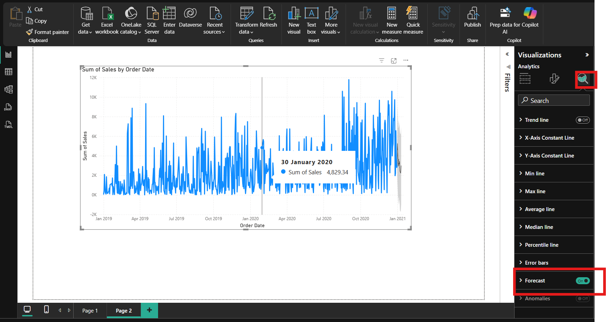

### Step 29 : Select the appropiate Units -> Days and Confidence Interval to get forecast

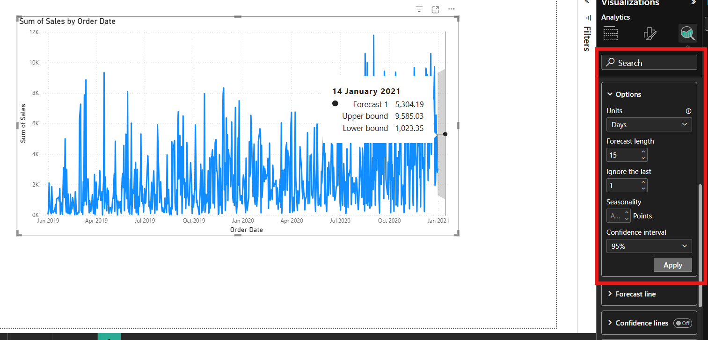

### Step 30 : Add Zoom Sliders and Unit Changes

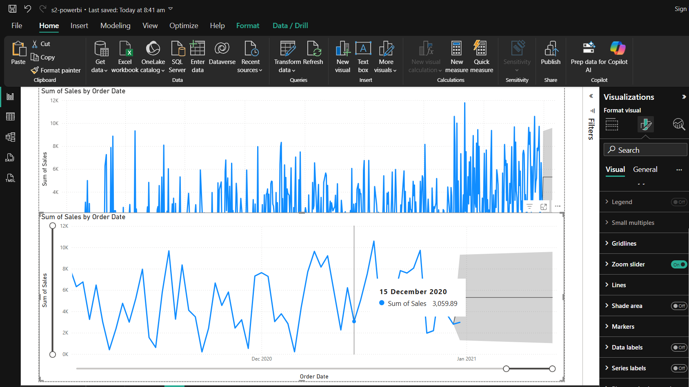

## New Table using DAX Queries

### Step 31 : Go to `Table View` -> `New Table`

Query : **SalesForecast = SUMMARIZE('SuperStore_Sales_Dataset', SuperStore_Sales_Dataset[Order Date], "Total Sales", SUM(SuperStore_Sales_Dataset[Sales]))**

## ✅ Summary - Power BI Session 2

In **Power BI Session 2**, we focused on advanced visualization techniques, DAX measures, and forecasting to derive actionable insights from the `SuperStore.csv` dataset.

---

### 🔍 Key Topics Covered

#### 🧼 Data Cleaning using Power Query

- Replaced incorrect values in the `Returns` column (e.g., changed text "N/A" to "0" or "1")
- Checked column quality and data types
- Removed extra/empty columns

#### 📊 Advanced Visualizations

- Clustered Bar Charts for:
  - Sales by Category
  - Top 3 Sub-Categories by Sales
  - Sales by Ship Mode
- Stacked Area Chart for:
  - Monthly Sales Comparison
  - Year-over-Year (YoY) Profit Analysis
- Donut Charts for:
  - Sales by Segment
  - Payment Modes
- Map Visuals for:
  - Sales by State (Bubble Size)
  - Profit (as Tooltip)
- Slicers:
  - Region Filter (Formatted as Tiles)
- KPI Cards:
  - Total Sales
  - Total Profit
  - Total Quantity
- Visual Styling:
  - Background gradients, rounded borders, transparency
  - Customized axes, bar colors, titles, and alignment

#### 🧠 Insightful DAX Measures

- `AvgDelivery` – Average delivery time between order and ship date
- `TotalDelivery` – Total number of deliveries
- `LateDelivers` – Deliveries taking more than 5 days
- `ReturnRate` – Percentage of returned orders per product

```dax
ReturnRate =
DIVIDE(
    CALCULATE(COUNTROWS('SuperStore_Sales_Dataset'), 'SuperStore_Sales_Dataset'[Returns] = "1"),
    CALCULATE(COUNTROWS('SuperStore_Sales_Dataset'))
)
```

### 📈 Forecasting

- Created **Line Chart** using:
  - **X-Axis**: `Order Date`
  - **Y-Axis**: `Sales`
- Enabled **Forecasting** via the analytics pane
- Configured:
  - **Confidence interval**
  - **Forecast length** (e.g., 10 days)
- Removed **year/month hierarchy** to allow **daily forecast**
- Enabled **zoom slider** and **timeline navigation**

---

### 📋 Custom Table Using DAX

Created a new table to summarize sales by order date:

```dax
SalesForecast =
SUMMARIZE(
    'SuperStore_Sales_Dataset',
    'SuperStore_Sales_Dataset'[Order Date],
    "Total Sales",
    SUM('SuperStore_Sales_Dataset'[Sales])
)
```

### Author

_Prepared by Yash Baviskar_  
_Power BI Roadmap - Session 1_ _and_ _2_
