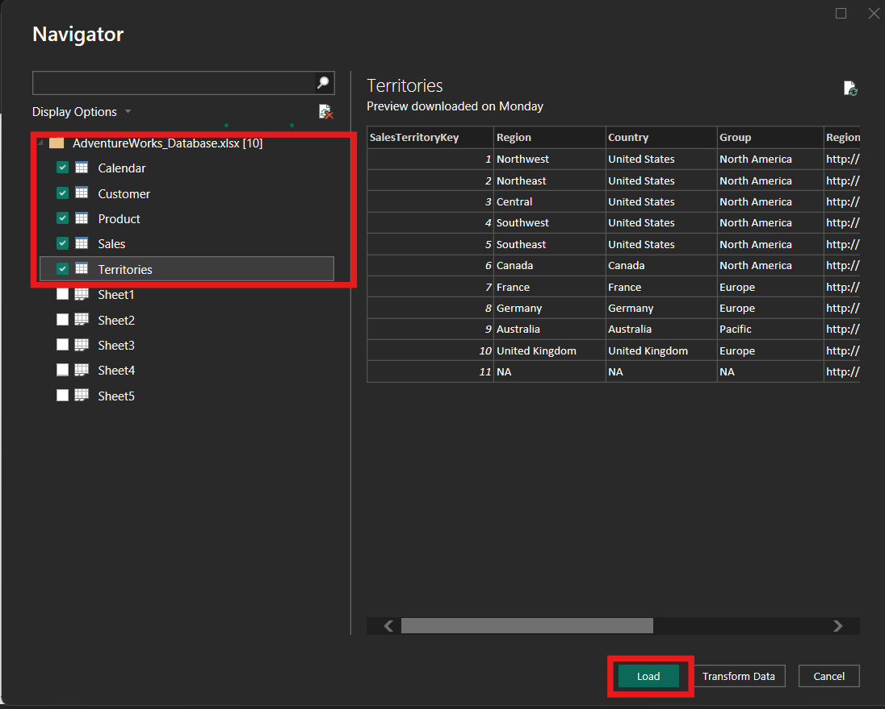

# Power BI Roadmap - Session 1 Notes

**Date:** Monday, 28/07/2025
**Session:** Introduction to Power BI

---

## 1️⃣ Introduction to Power BI

Power BI is a **business intelligence and data visualization tool by Microsoft**.  
It helps convert raw data into **interactive dashboards and reports**, allowing businesses to make **data-driven decisions**.

Key highlights of Power BI:

- Can connect to multiple data sources (Excel, SQL, Web APIs, etc.).
- Provides **drag-and-drop visualization** features.
- Allows **data cleaning and transformation** without heavy coding.
- Enables **sharing dashboards and reports** on Power BI Service (cloud).

Use cases of Power BI:

- Analyzing sales and financial data.
- Creating company-wide performance dashboards.
- Reporting KPIs and operational metrics.

---

## 2️⃣ Installation of Power BI

To get started, we need **Power BI Desktop**:

1. **Download Power BI Desktop** from:
   - [Microsoft Store](https://apps.microsoft.com/store/detail/power-bi-desktop/9NTXR16HNW1T)
   - or [Official Power BI Website](https://powerbi.microsoft.com/)
2. **Install the application** like any Windows program.
3. **First look after installation:**
   - **Report View (Canvas):** Where you design dashboards.
   - **Data View:** Shows raw data tables after loading.
   - **Model View:** Displays relationships between tables.

---

## 3️⃣ Sections in Power BI

Power BI is broadly divided into **three main sections** for workflow:

### a) Power Query (ETL Layer)

- Purpose: **Extract, Transform, Load (ETL)** data before analysis.
- Common operations:
  - Removing duplicates
  - Splitting columns
  - Filtering rows
  - Changing data types
  - Merging and appending datasets
- **Interface:** Called _Power Query Editor_, opens in a separate window.

### b) Data Modeling

- Purpose: **Define relationships between tables** and build a logical model for reporting.
- Key points:
  - Create **one-to-many** and **many-to-many** relationships.
  - Set **primary and foreign keys** for relational modeling.
  - Hide unnecessary columns to simplify reporting.
  - Optimize model for **performance and simplicity**.

### c) DAX (Data Analysis Expressions)

- Purpose: Create **calculated columns, measures, and KPIs**.
- DAX is similar to Excel formulas but designed for **data aggregation and modeling**.
- Examples:
  - `SUM(Sales[Revenue])` → Sum of revenue column.
  - `CALCULATE(SUM(Sales[Revenue]), Region="West")` → Revenue for West region only.

---

## 4️⃣ Getting Data into Power BI

- Use the **Get Data** button on the Home ribbon.
- Popular data sources:
  - **Flat files:** Excel, CSV, JSON
  - **Databases:** SQL Server, MySQL, PostgreSQL
  - **Online services:** SharePoint, Google Analytics, Web APIs
- After selecting a source:
  1. Connect to the file or server.
  2. Preview data in **Navigator Window**.
  3. Load data directly or **Transform Data** in Power Query.

---

## 5️⃣ Power Query Data Cleaning Operations

During the session, we performed **basic data cleaning** using Power Query:

1. **Renaming Columns:**  
   Makes the dataset more readable for reporting.
2. **Changing Data Types:**  
   Example: Convert a column from _Text_ to _Date_ for time-based analysis.

3. **Removing Unnecessary Columns:**  
   Helps reduce clutter and memory usage.

4. **Filtering and Sorting:**  
   Only keep relevant rows and order data logically.

5. **Handling Missing Data:**  
   Replace nulls, remove blanks, or create default values.

6. **Removing Duplicates:**  
   Ensures accuracy in reporting, especially for sales or transactional data.

**Note:** All operations in Power Query are **recorded as steps** and can be modified or removed anytime.

---

## Dataset Tutorial and Steps

Make sure you have `AdventureWorks_Database.csv` and `Budget.csv` files present in your local system, you can download them from this repositary

### Step 1 : Importing Data Sets from the `Get Data` section of Ribbon

### Step 2 : Connect to `Excel Workbook` option and choose `AdventureWorks_Database.csv` from your local machine

### Step 3 : Select the Tables and Load the Dataset

### Step 4 : After loading, select the `Model View`

Review the relationships between tables and their connections to each other, PowerBI Auto Models the Dataset for you, but you can manually model your dataset through common `Primary Key` eg : Product Key and Dragging the relationships between them

### Step 5 : Select `Get Data` Again and select `Budget.csv` and then select `Transform Data` option this time

### Step 6 : Review the **Power Query Editor** and it's different section

Applied Steps

Power Query Ribbon for operations

Table selection

## Data Cleaning Process

### Step 8 : Remove top redudant rows

We can see that first two rows are redudant and ought to be removed for clearning data purposes

Write **2** in the input box to remove those rows

### Step 9 : Use Top Row as headers

For proper display purposes of the dataset, we can use Top Column Name as `Headers`, We can select

### Step 10 : Removing Redudant Columns

Scrolling to the Rightmost column `Grand Total` column is redudant for our purposes (it is derivable by summation of other columns)
Hence it can be removed by _Right clicking_ on the column and removing it

### Step 11 : Removing Redudant Rows

Looking at the dataset we can see that `subTotal` Rows have null values which ought to be removed, hence we have to filter them out

### Step 12 : Text filtering

in the `Category` Column we Select `Text Filters` Option -> `Does not Contain` to remove the redudant subTotal Rows

## Basic Data Transformation

### Step 13 : To Transform the Data to Convert from Column Years (`Jan`, `Feb`....) to Rows (Pivoting), Select The Year Columns and Press `Shift Key` to select all columns from `Jan` to `Dec`

### Step 14 : Go to `Transform` ribbon icon and select `Unpivot Columns` to pivot the columns to rows (while keeping the year columns selected)

### Step 15 : Rename Column Name after Transformation -> Double Click on `Attribute` to change to `Date` and `Value` -> `BudgetAmount`

### Step 16 : Change Data Type of `Date` Column

### Step 17 : Review the Steps in `Applied Steps` and `Close & Apply` the Changes

### Step 18 : Review the newly added `Budget Table` and Concept of **Data Tables** and ** Lookup Tables** in relation to these data sets

## 🛠️ Hands-On Summary

During the session, we:

- **Imported dataset** using _Get Data_.
- **Opened Power Query Editor** for cleaning.
- **Performed transformations:**
  - Removed duplicates and null values.
  - Renamed columns for clarity.
  - Changed column data types.
- **Closed and Applied** the cleaned dataset to Power BI.

---

## Next Steps (Session 2 Preview)

- Explore **Data Modeling** and create table relationships.
- Learn **basic DAX functions** for calculated columns and measures.
- Begin **creating visual dashboards** with charts and slicers.

---

### Author

_Prepared by Yash Baviskar_  
_Power BI Roadmap - Session 1_
